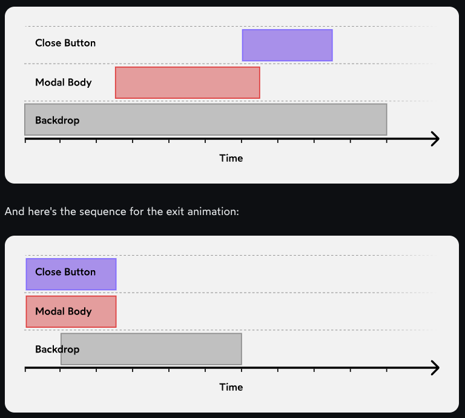

# Orchestration

Instead of everything happening all at once, the individual elements are staggered

## Example



## Implementing orchestration

```jsx
unction Modal({ isOpen, handleDismiss, children }) {
  return (
    <Wrapper>
      <Backdrop
        style={{
          opacity: isOpen ? 0.75 : 0,
          transition: 'opacity',
          transitionDuration: isOpen
            ? '1000ms'
            : '500ms',
          transitionDelay: isOpen
            ? '0ms'
            : '100ms',
          transitionTimingFunction: isOpen
            ? 'ease-out'
            : 'ease-in',
        }}
        onClick={handleDismiss}
      />
      <DialogContent
        style={{
          transform: isOpen
            ? 'translateY(0vh)'
            : 'translateY(100vh)',
          transition: 'transform',
          transitionDuration: isOpen
            ? '400ms'
            : '250ms',
          transitionDelay: isOpen
            ? '250ms'
            : '0ms',
          transitionTimingFunction: isOpen
            ? 'ease-out'
            : 'ease-in',
        }}
      >
        <ButtonWrapper>
          <CloseButton
            onClick={handleDismiss}
            style={{
              opacity: isOpen ? 1 : 0,
              transform: isOpen
                ? 'translateY(0)'
                : 'translateY(25%)',
              transition: 'opacity, transform',
              transitionDuration: '250ms',
              transitionDelay: isOpen ? '600ms' : '0ms',
            }}
          />
        </ButtonWrapper>
        {children}
      </DialogContent>
    </Wrapper>
  )
}
```
