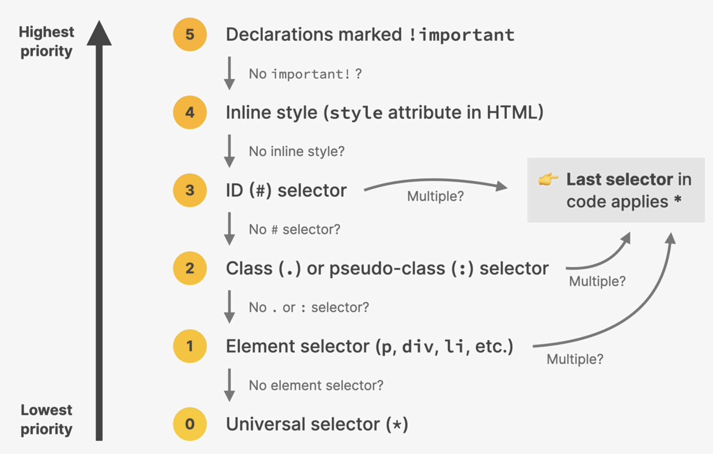

# Specificity

Weight assigned to CSS rules, determined by the number of each selector type. When multiple rules that target the same HTML element are declared and that have the same specificity, the last one wins.

