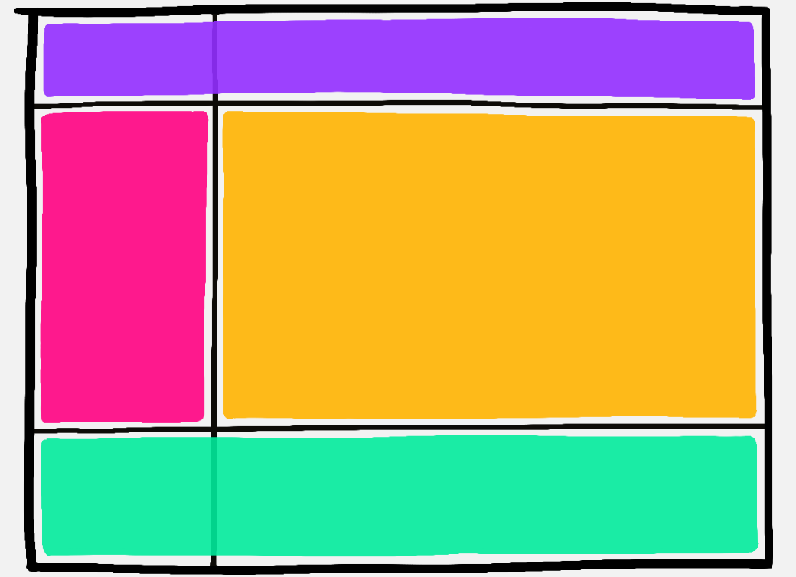

# Mental Model

CSS Grid is so powerful because the grid structure can be selectively ignored

## 1. Rows/Columns are invisible markers

Tools that our HTML elements can use to position themselves.
**Rows and columns are like the painted lines in parking lots**

- Like the chaotic driver that parks across three parking spots, we can choose elements to span across a number of columns.
- spots can be totally empty
